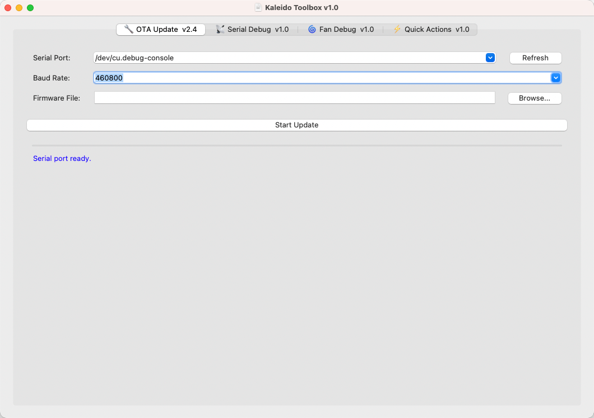
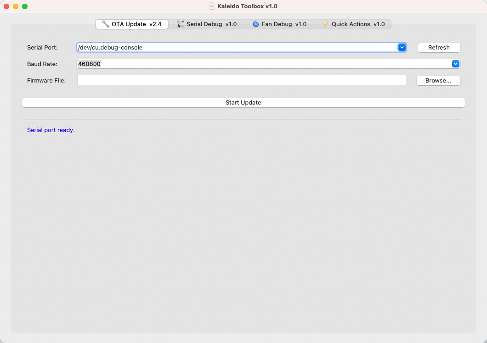
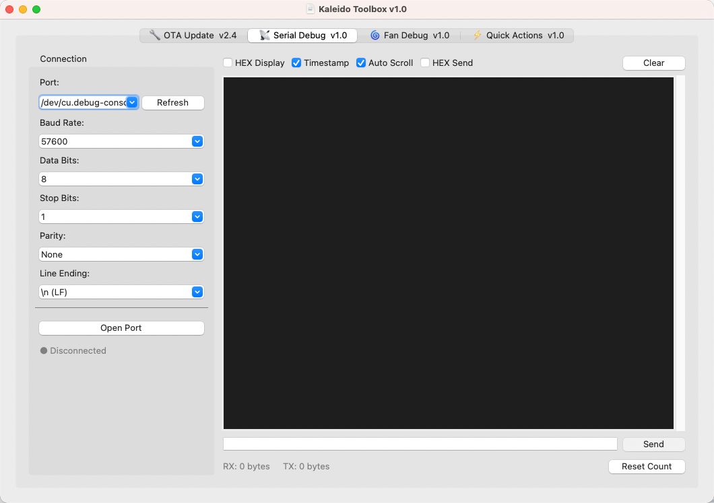
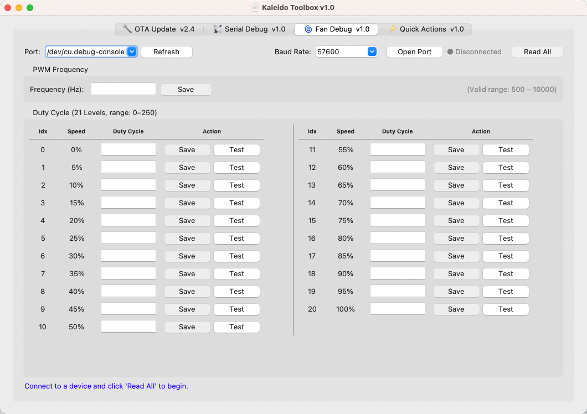
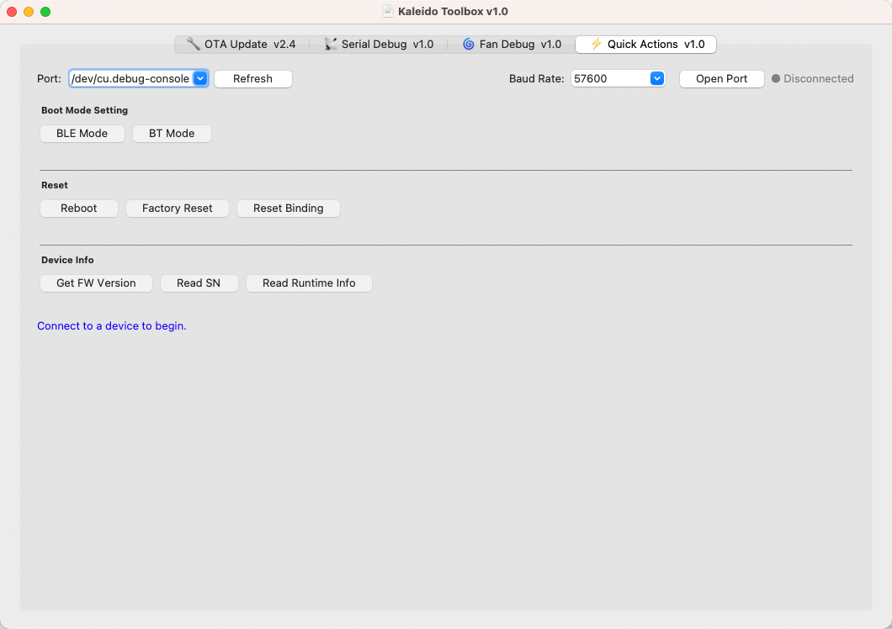

# 🛠️ Kaleido Toolbox

<p align="center">
  <b><a href="#english">English</a></b> | <b><a href="#简体中文">简体中文</a></b>
</p>

---

<a name="english"></a>

## 🛠️ Kaleido Toolbox (English)

A collection of debugging tools for the Kaleido Roaster series, providing features like firmware updates, serial debugging, fan debugging, and quick actions.

<p align="center">
  
</p>

---

### ✨ Features

| Feature | Description |
|------|------|
| 🔧 OTA Update | Wireless firmware upgrade, supports multiple baud rates |
| 📡 Serial Debug | Serial communication debugging, supports HEX/Text modes |
| 🌀 Fan Debug | Fan PWM parameter debugging, 21-level speed adjustment |
| ⚡ Quick Actions | Quick action panel, one-click execution of common commands |

---

### 📥 Download & Installation

Go to the **[Releases](../../releases/latest)** page to download the latest version:

| Platform | File |
|------|------|
| macOS (Apple Silicon) | `KaleidoToolbox-vX.X.X-macOS-arm64.dmg` |
| macOS (Intel) | `KaleidoToolbox-vX.X.X-macOS-x64.dmg` |
| Windows (64-bit) | `KaleidoToolbox-vX.X.X-Windows-x64.zip` |

---

### 🔌 Driver Installation

This tool communicates with the device via a USB-to-Serial chip (CP2102). You need to install the driver for the first use.

👉 **[View Driver Installation Guide](drivers/README.md)**

---

### 🖼️ Screenshots

<p align="center">
  
  &nbsp;&nbsp;
  
</p>

<p align="center">
  
  &nbsp;&nbsp;
  
</p>

---

### 🚀 Quick Start

1. Download the installation package for your platform from [Releases](../../releases/latest).
2. Install the [CP2102 Driver](drivers/README.md) (if necessary).
3. Connect the Kaleido Roaster via a USB cable.
4. Open Kaleido Toolbox, select the serial port and connect.

---

### ⚠️ FAQ

#### macOS: "App cannot be opened because the developer cannot be verified"

```
Right-click the app → Select "Open" → Click "Open" again in the popup dialog.
```

Or run the following command in the terminal:

```bash
xattr -cr /Applications/KaleidoToolbox.app
```

#### Windows: Cannot recognize the serial port

Please ensure the [CP2102 Driver](drivers/README.md) is installed. Re-plug the USB cable after installation.

---

### 📄 License

This project is for Kaleido device users only.

<p align="right">(<a href="#-kaleido-toolbox">Back to Top</a>)</p>

---

<a name="简体中文"></a>

## 🛠️ Kaleido Toolbox (简体中文)

Kaleido 烘豆机系列调试工具集，提供固件升级、串口调试、风扇调试和快捷指令等功能。

<p align="center">
  
</p>

---

### ✨ 功能特性

| 功能 | 说明 |
|------|------|
| 🔧 OTA Update | 无线固件升级，支持多波特率 |
| 📡 Serial Debug | 串口通信调试，支持 HEX/Text 双模式 |
| 🌀 Fan Debug | 风扇 PWM 参数调试，21 级速度调节 |
| ⚡ Quick Actions | 快捷指令面板，一键执行常用命令 |

---

### 📥 下载安装

前往 **[Releases](../../releases/latest)** 页面下载最新版本：

| 平台 | 文件 |
|------|------|
| macOS (Apple Silicon) | `KaleidoToolbox-vX.X.X-macOS-arm64.dmg` |
| macOS (Intel) | `KaleidoToolbox-vX.X.X-macOS-x64.dmg` |
| Windows (64-bit) | `KaleidoToolbox-vX.X.X-Windows-x64.zip` |

---

### 🔌 驱动安装

本工具通过 USB 转串口芯片（CP2102）与设备通信，首次使用需安装驱动程序。

👉 **[查看驱动安装指南](drivers/README.md)**

---

### 🖼️ 界面截图

<p align="center">
  
  &nbsp;&nbsp;
  
</p>

<p align="center">
  
  &nbsp;&nbsp;
  
</p>

---

### 🚀 快速开始

1. 从 [Releases](../../releases/latest) 下载对应平台的安装包
2. 安装 [CP2102 驱动](drivers/README.md)（如需要）
3. 通过 USB 线连接 Kaleido 烘豆机
4. 打开 Kaleido Toolbox，选择串口并连接

---

### ⚠️ 常见问题

#### macOS 提示"无法打开，因为无法验证开发者"

```
右键点击应用 → 选择「打开」→ 在弹出对话框中再次点击「打开」
```

或在终端执行：

```bash
xattr -cr /Applications/KaleidoToolbox.app
```

#### Windows 无法识别串口

请确认已安装 [CP2102 驱动](drivers/README.md)，安装完成后重新插拔 USB 线。

---

### 📄 许可证

本项目仅供 Kaleido 设备用户使用。

<p align="right">(<a href="#-kaleido-toolbox">返回顶部</a>)</p>
